# **Price prediction of the diamonds**

### **Participants:**
### **Sultan Kudaybergenov**, 
### **Alua Orynbassarova**, 
### **Zhanmadi Toleugazyuly**
### [YouTube Video](https://youtu.be/9gDdshN4hrQ?si=rCtVmWFeU9rlP17n)

 
 
 

# **Table of Contents**

 1. [Introduction](#introduction)

	1. [Problem](#problem)

	2. [Another Solutions](#another-solutions)

	3. [Current Work](#current-work)

2. [Data and Methods](#data-and-methods)

	1. [Data](#data)

	2. [Methods](#methods)

3. [Results](#results)

4. [Web-site](#web-site)

5. [Discussion](#discussion)

 
 
 

# Introduction

## Problem

The primary objective of this project is to create a machine learning model designed to forecast the pricing of brilliant-cut gemstones. This predictive tool aims to offer valuable insights to jewelers, gemstone enthusiasts, and industry experts, providing precise and timely estimates derived from diverse gemstone attributes. 

## Another Solutions

Determining the price of gemstones, particularly those featuring brilliant cuts, is a complex problem, which is influenced by numerous factors like carat weight, cut quality, color, clarity, and other attributes. Traditional methods may lack precision, and incorporating a machine learning approach can enhance the accuracy of cost predictions. 

Existing Solutions with References: While there are current techniques for estimating gemstone costs, the integration of machine learning offers a more data-driven and adaptable approach. Pertinent research and articles on gemstone pricing include:  "Gemstone by value": [“Gemstones By Value- A Full Comparison Of Gem Prices And Value | Chroma Gems & Co”] . "Gemresearch Swiss Lab": [“Dramatic rise in prices for fine gemstones as high-end ruby, emerald and sapphire sales soar- GRS (gemresearch.ch)”]

## Current Work

The dataset for this work was taken from the “data.world” website, [Diamonds - dataset by nahrin | data.world.](https://data.world/nahrin/diamonds) We had analyze on the data, made necessary feature engineering, cleaning data. Used 3 models, which is Linear Regression, Decision tree and Random forest and results are provided by numbers and visually.  All needed packages (seaborn, matplotlib, pandas, numpy and so on) were imported. This is our link to the dataset https://drive.google.com/file/d/1D27emSL7AVG8-nW8iuyhr9vBi8tsLP2U/view?usp=sharing 

 
 

# Data and Methods.

## Data

- In the dataset “Diamonds”** we have 10 parameters (carat, cut, color, clarity, depth, table, price, x, y, z). Data types are object, float64, int64.
- Shape of our dataset is 53490 rows and 10 columns, which does not have null values.
- In the figure 2, we can see statistical description of our data on our dataset, like mean, min value, standard deviation and so on. 

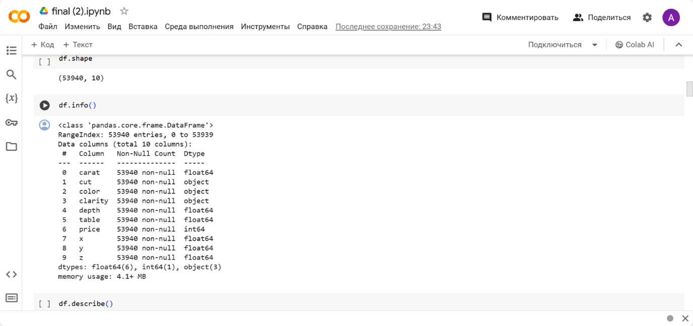*Figure 1*

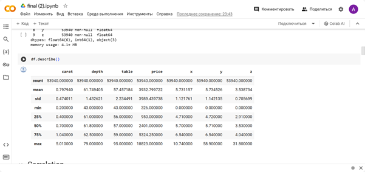*Figure 2*

- A correlation matrix is a square table that shows the correlation coefficients between all pairs of variables in a dataset. Each element of the correlation matrix shows the correlation coefficient between two variables. The correlation matrix is usually used to study the dependencies between variables and identify the most significant relationships. 
- According to the figure, carat has the highest correlation with price.
- Figure 4. The x-axis corresponds to the 'carat' values, the y-axis corresponds to the 'price' values, and the color of each point is determined by the 'cut' category. The opacity is set to 0.7 for a slight transparency effect. We can see that price will be changed with the rise of carat and the type of cut.
**

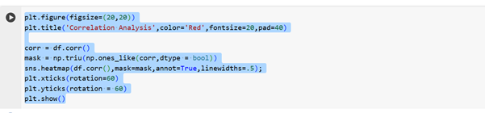

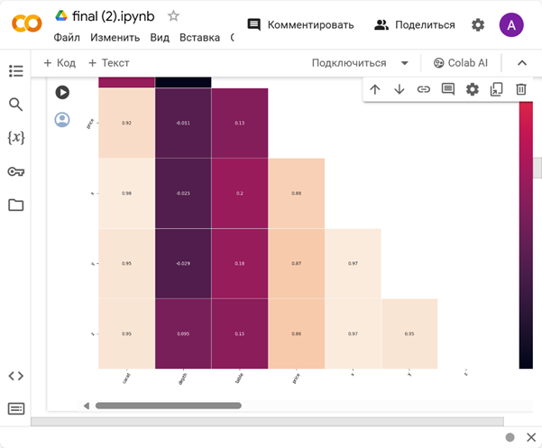*Figure 4(code for correlation analysis)*

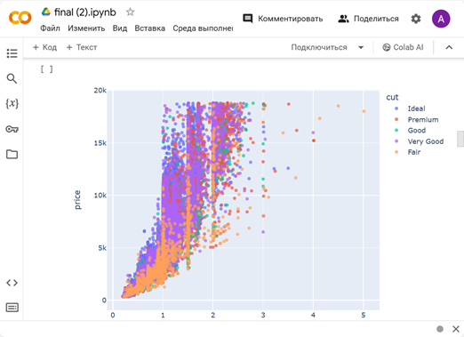*Figure 5*

- Dropping x, y, z that has values equal to 0 and greater than 10, as they can be considered as outliers.
- Also, we did feature engineering, by creating new value, the volume, multiplying x, y and z, as they have high dependency on each other. You can see that on the correlation matrix. For example, correlation x with y and z is approximately 0.97.(According to the Figure 3) 
- In the figure 7 we did transformation of the categorical parameters (cut, clarity, color) to the numbers. For example, df['cut'].replace({'Ideal':5, 'Premium':4, 'Good':3, 'Very Good':2, 'Fair':1}, inplace=True).

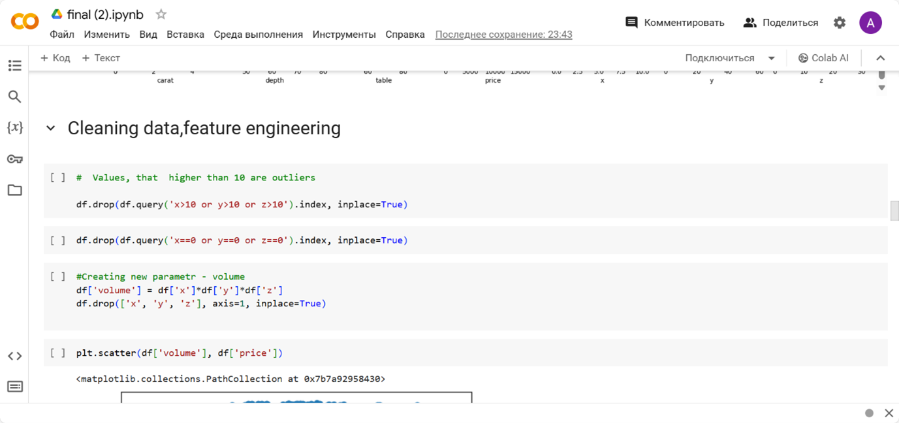*Figure 6*

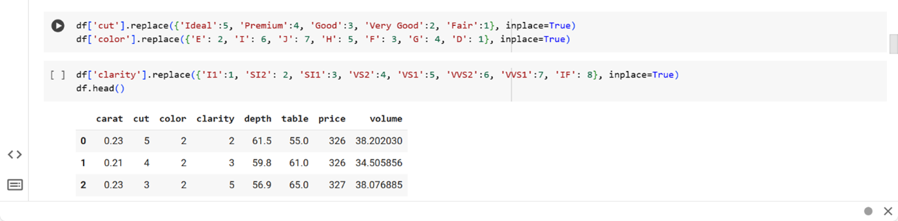*Figure 7*

## Methods

### **Linear Regression**

- First method that we used, is Linear Regression.
- Linear regression is a type of supervised machine learning algorithm that computes the linear relationship between a dependent variable and one or more independent features. To find the optimal values of the coefficients b0 and b1, the least squares method (OLS) is used, which minimizes the sum of the squared errors between the model predictions and the real values of the dependent variable. This allows you to find the linear function that best matches the data.
- Metrics that was used id RMSE. The root mean square error (RMSE) measures the average difference between a statistical model’s predicted values and the actual values. Mathematically, it is the standard deviation of the residuals. Residuals represent the distance between the regression line and the data points. RMSE quantifies how dispersed these residuals are, revealing how tightly the observed data clusters around the predicted values.
- This is results of the RMSE. Train RMSE: 1228.1010153614354 Test RMSE: 1189.439776360689

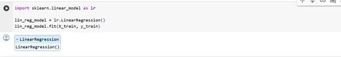*Figure 8*

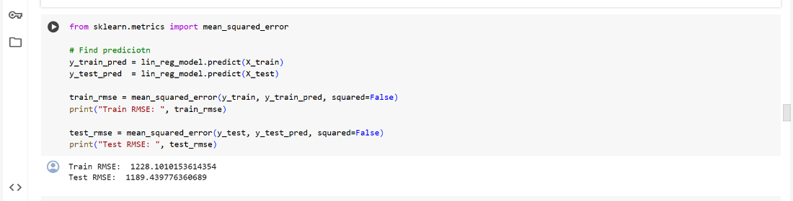*Figure 9*

### **Decision tree.**

- The second method was the decision tree.
- Decision Tree is a decision-making tool that uses a flowchart-like tree structure or is a model of decisions and all of their possible results, including outcomes, input costs, and utility. Decision-tree algorithm falls under the category of supervised learning algorithms. It works for both continuous as well as categorical output variables.
- Train RMSE: 33.94076229671313 Test RMSE: 700.3897703232303. Results of decision tree.

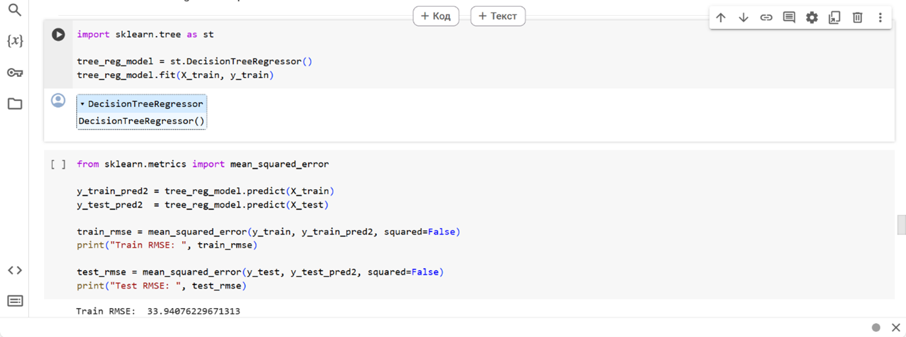*Figure 10*

### **Random Forest.**

- The random forest algorithm for regression problems is applied as follows:

A random forest consists of a large number of decision trees that are built on random subsets of training data and random subsets of features.

Each decision tree is trained on a random subset of data and features. This avoids overfitting and increases the stability of the model.

When predicting the value of a target variable for a new dataset, each decision tree makes its own prediction.

To obtain a final prediction, the predictions of all decision trees are averaged.

- Results of the Random Forest. Train RMSE: 205.54252381804545 Test RMSE: 521.8847878233919

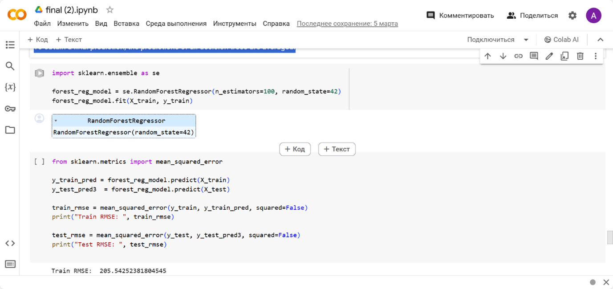*Figure 11*

 
 

# Results

### **Linear Regression.**

- Figure 10 represents the results of our model and to find results in percentage we used R-square formula. 
- The coefficient of determination (R2) is a statistical measure that is used to assess how well a linear regression model fits the data. The coefficient of determination takes values from 0 to 1 and shows the proportion of variance of the dependent variable (Y), which is explained by the linear regression model. The higher the R-squared value, the better the model fits the data.

The formula for calculating the R-square:

R-square = 1 - (SSres / SStot)

- Results of linear regression is for training data: 90.63% Results for testing: 90.60%

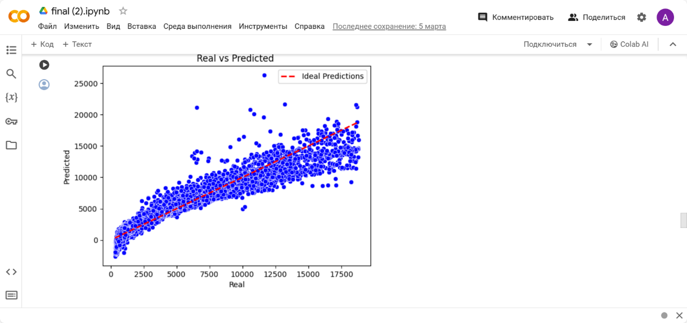*Figure 12*

### **Decision tree.**

- Also, to visually represent our result, we used this code:

sns.scatterplot(x=y\_test, y=y\_test\_pred2, color="pink")

plt.title('Real vs Predicted test values for Decision Tree')

plt.xlabel('Real')

plt.ylabel('Predicted')

plt.plot([min(y\_test), max(y\_test)], [min(y\_test), max(y\_test)], linestyle='--', color='red', linewidth=2, label='Ideal Predictions')

plt.show()

- Results for training data: 99.99% Results for testing: 96.74%, which is higher than in the Linear Regression Model.

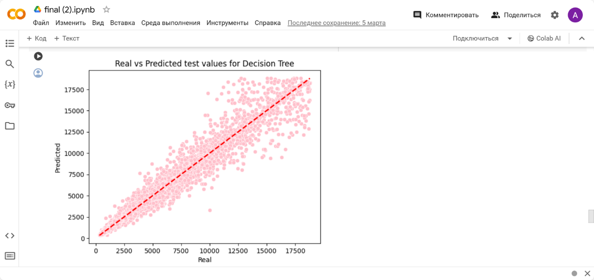*Figure 13*

### **Random Forest.**

- In the figure 12 you can see how close our predictions to the real values.
- Result for random forest: 99.74% Result for random forest: 98.19

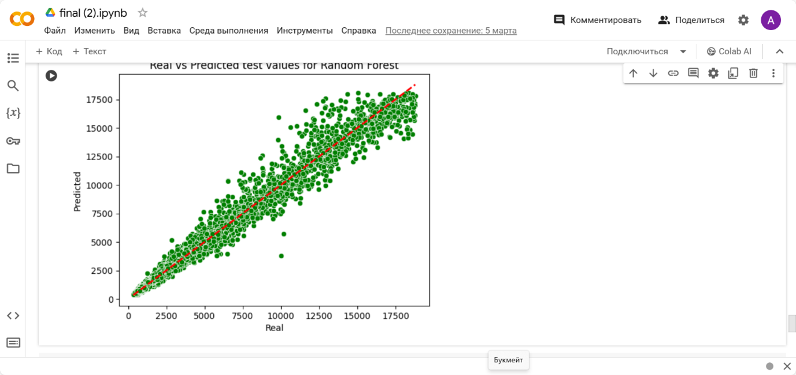*Figure 14*

 
 

# Web-site

Our team has created a website to predict the price of a diamond based on its characteristics (e.g., carat weight, cut, clarity, color). 

The site is written in flask and uses the following libraries:

- Flask v3.0.2
- Bootstrap v5.0.2
- Joblib v1.3.2
- Pandas v2.2.1
- Scikit-learn v1.2.2

Project structure:

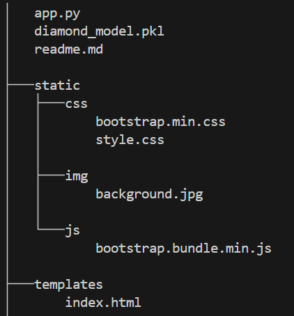

To run you need to use command: python app.py

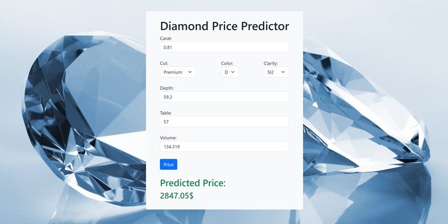

 
 

# Discussion

In this work, 3 methods were used, which is Linear Regression, Decision tree and Random Forest. According to their performance, the best model, that had the highest result in the percentage is Random Forest, 99.74% and 98.19%, which means that the model represented good results on training data and on the test data. To make decision on which model is better, we calculated it through the coefficient of determination (R2). To represent a graph, with real and predicted data seaborn package was used. 

To improve this work, in the future we can make tunning of parameters of decision tree, as it tended to overfit, we can make changes on the height of the tree, numbers of features on the leaf and so on. 
